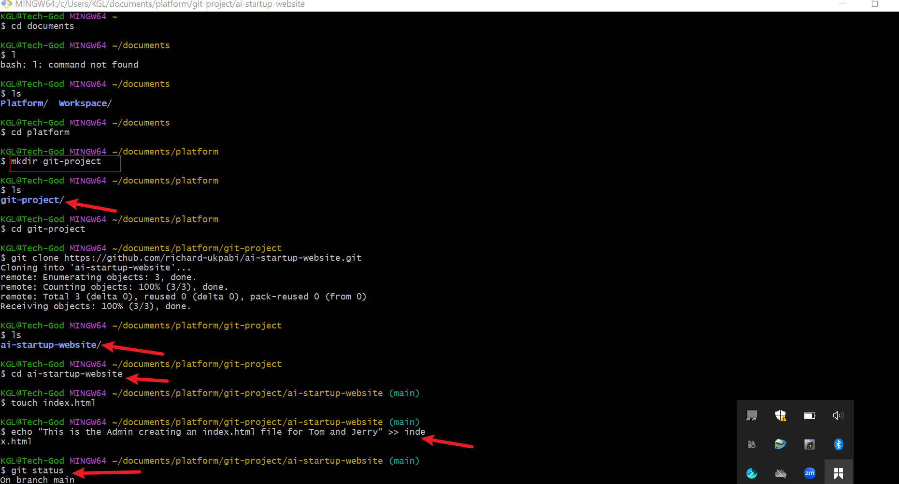
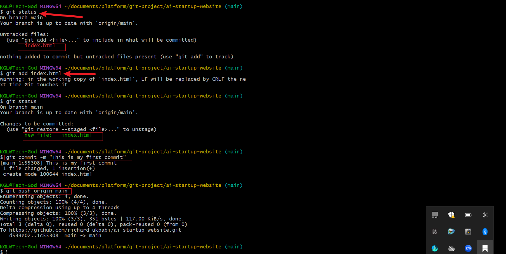
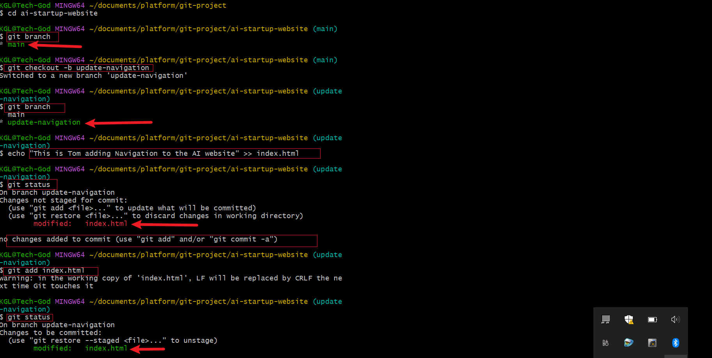
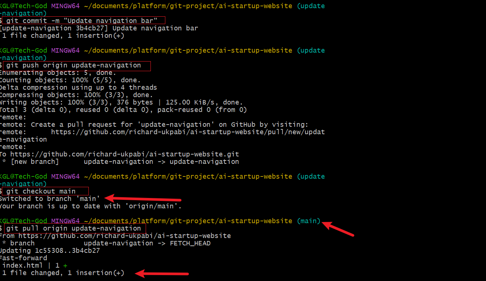
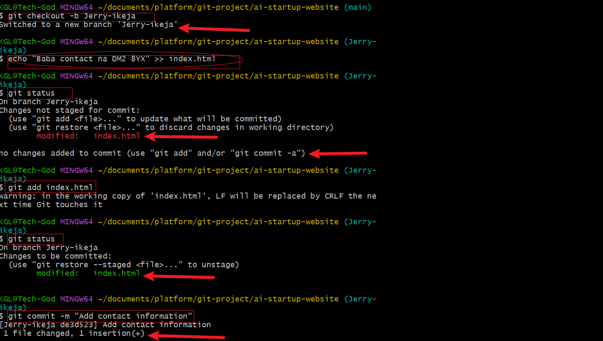
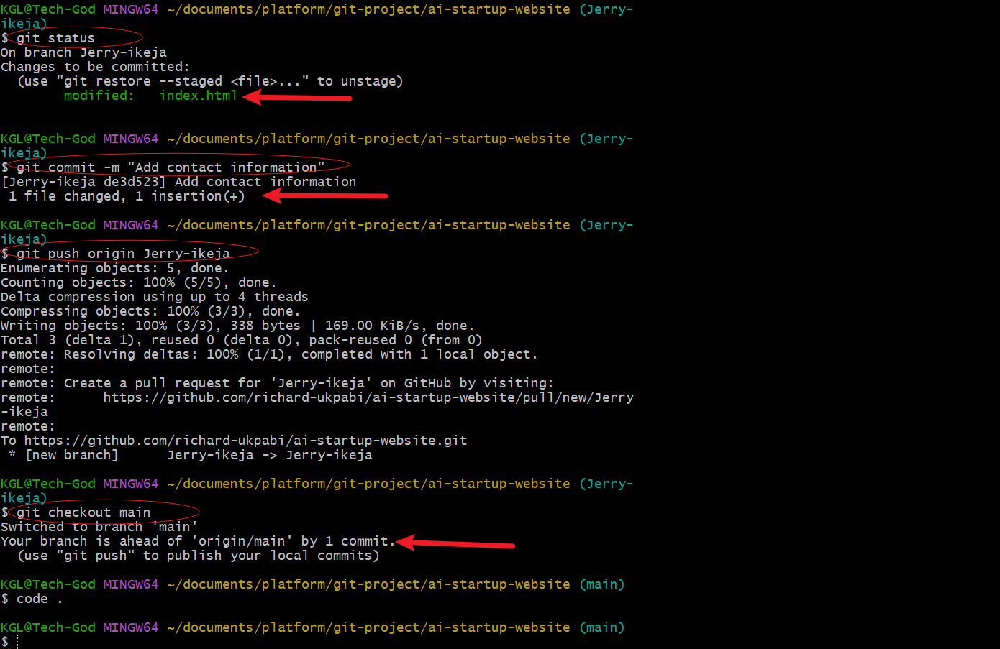

# Basic Git command
## Collaborative website development with Git and GitHub.

This is a hand on git project that teaches and fosters the primary essence and use of git and github in colloboration in software development.

The section is broken into the following:

1
- setup and initial configuration 
- creation of GitHub Repository
- cloning the repository

2

- Simulating Tom'work

3

- Simulating Jerry's work

To aid our understanding, enabling pictures will be used to guide the work done.

 Cloning the repository
-----------------
Setup and initial configuration + creation of github repository were done intially, our pictorial depiction of worksone will start from cloning the repository as see below

The first arrows shows the creation of git-project in the work directory called platform and subsequent cloning of the repository into the directory before navigating to the cloned repository on the local machine. The fourth arrow shows the creation and updating the index.html file with the required content.

The first arrow in the above picture (git status) confirms the status of file and content. the second arrow shows when the file is added, commited with the caption' this is my first commit' and eventual push.

Simulating Tom's work
--------------------
In simulating Tom's work, a branch was created for Tom (update-navigation) and switched to using the command (`git checkout-b`) to warehouse Tom's work/input

Thereafter Tom updates the index.html file before adding the file and content to staging. the changes made to the file are seen commited with the message `update navigation bar` before been pushed. Thereafter a checkout is done back to main before pulling the work done by Tom.

SIimulating Jerry's work
-------------------------
In simulating Jerry's work, a branch was created for Jerry (Jerry-ikeja) and switched to using the command (`git checkout-b`) to warehouse Jerry's work/input

Thereafter Jerry updates the index.html file before adding the file and content to staging. the changes made to the file are seen commited with the message `add contact info` before been pushed. Thereafter a checkout is done back to main.