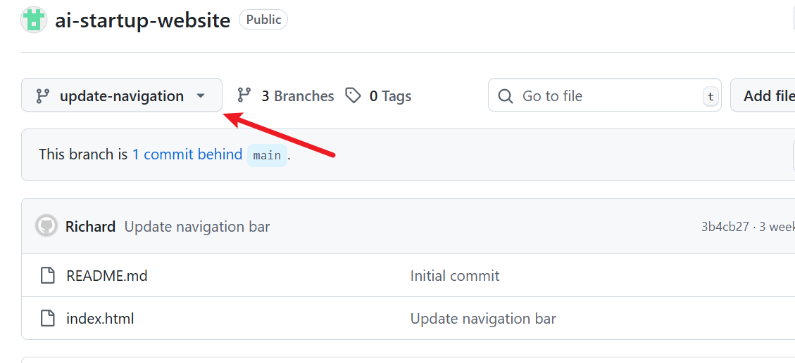

##GIT BRANCHING AND MERGING CHANGES

 The Essence of this project is to 
 
 - create a pull request
 - Merge Pull request into a main branch

 Create a Pull request.

 1. Navigate to github page and switch from main to update-navigation.

 

2. Create new pull request.

   In creating a new pull request from github, you are taken to a new page where you can review and compare Tom's work.

   
3. After the pull request is done, we are taken to the page to review and compare Tom's work

4. After reviewing and providing a title and description and everything looks good, click create pull request again to officially open the pull request

#Merging Pull request to main branch

The pull request is then merged into the main branch to update the main branch with all the changes that has been made.

To update Jerry-ikeja branch with the changes made on the main branch, we run the following command git pull origin main

This was followed by a git push to update the main branch with updated Jerry's work which include the updated Tom's work.

This concludes the end of the project work.